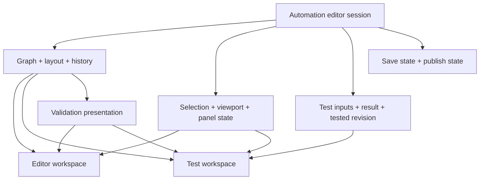

# Harly Automations — auditoría de experiencia y plan de rediseño

> **Nota del 16 de septiembre de 2026:** este informe conserva el estado observado el 14 de septiembre. El Builder cambió después de esta auditoría. La revisión consolidada y el estado actual de la integración con Harly AI están en [Harly AI × Automations Builder](harly-ai-automations-integration-audit-2026-09-16.md). Reproduce cada hallazgo antes de tratarlo como vigente.

**Fecha:** 14 de septiembre de 2026  
**Destinatarios:** producto, diseño y agente de implementación  
**Base:** `/Users/maximiliano/Downloads/curious-monkey/.worktrees/automations-revamp` · rama `feat/automations-revamp` · HEAD `e4dcae6`, con cambios locales.  
**Tipo de entrega:** auditoría y especificación; no se implementó el rediseño.

## 1. Diagnóstico ejecutivo

El problema principal es que Harly expone el modelo técnico del motor antes de enseñar al reclutador cómo construir una automatización. Hay una base funcional importante: biblioteca, búsqueda, arrastre implementado, conexiones, inspector, historial de comandos, simulador y controles de publicación. Sin embargo, la experiencia exige traducir constantemente entre “recipe”, “workflow”, “block”, “step”, “When”, “Trigger”, “Then” y “Action”.

La interfaz permite construir un grafo, pero ayuda poco a responder cuatro preguntas: **qué quiero conseguir, qué debo configurar ahora, qué ocurrirá con una candidatura y qué falta para activarlo**. Añadir iconos ayudará al reconocimiento; por sí solo no resolverá esa estructura.

La recomendación es un editor visual orientado a reclutamiento, con biblioteca contextual, lienzo de lectura vertical e inspector progresivo. La prueba debe conservar el contexto del flujo y mostrar el recorrido y el resultado por paso. La publicación debe presentarse como una etapa explícita, conservando las aprobaciones existentes.

Antes del trabajo estético hay que corregir tres problemas de interacción: la pérdida del historial al cambiar de pestaña, la inserción arbitraria de “Add note” con el botón “+” y el formulario de condiciones comprimido dentro del inspector. Después, unificar validación, lenguaje y presentación de las pruebas.

## 2. Alcance, evidencia y límites

### Método

Se inspeccionó la aplicación en Chrome mediante capturas y árbol de accesibilidad, se realizaron interacciones sobre un flujo nuevo sin guardar y se contrastaron los comportamientos con el código del worktree indicado. Se revisaron Jobs como referencia visual del producto, el listado de automatizaciones, las plantillas, un flujo existente, el editor de condiciones, el editor de email, las transiciones entre editor y tester y el historial sin ejecuciones.

Se consultaron `DESIGN.md`, los tokens de `globals.css`, los componentes de navegación y los contratos del editor. Las capturas aportadas de Zapier, n8n y workflow-builder se usan como referencias visuales, no como prueba del comportamiento actual de esos productos ni como instrucciones. No se hizo una auditoría funcional de los servicios de Zapier o n8n.

La sesión comenzó con `ERR_CONNECTION_REFUSED`. El servidor se recuperó y el usuario realizó correcciones durante el recorrido. Hubo recargas y cambios de tema durante la sesión; no se atribuyen esas recargas a un defecto del producto. Las referencias de líneas corresponden al código leído en esta fecha y deben revalidarse si continúan los cambios locales.

### Recorridos y resultados

| Recorrido | Resultado observado |
|---|---|
| Abrir `/dashboard/automations/new` | Un disparador por defecto, nombre vacío, estado “Saved”, dos incidencias de conexión |
| Añadir email por biblioteca | Se crea y conecta automáticamente; se abre el inspector |
| Buscar `End` y añadirlo | Se conecta al email; la búsqueda también devuelve elementos que contienen “send” |
| Simular un flujo incompleto | Devuelve mensajes de conexión sin navegación a la corrección |
| Simular email sin contenido | Rechazado por el servidor: “Choose an email template or write a subject and body.” |
| Simular disparador → email con asunto/cuerpo ficticios → fin | “Simulation finished: succeeded.”; tres pasos; sin envío real según el resultado y la ruta de simulación inspeccionada |
| Pulsar “+” entre dos pasos | Inserta inmediatamente “Add note” |
| Cambiar editor → prueba → editor | Se mantienen los nodos; se pierde selección e historial Undo |
| Añadir condición y primer filtro | Campo de valor visualmente comprimido; resumen con `candidate.source` |
| Abrir plantillas | Galería disponible desde el listado; no equivalente visible dentro del editor |
| Abrir automatización existente | Estado Draft y “Request approval”; no se solicitó aprobación ni se publicó |
| Abrir Runs | Estado de carga y, posteriormente, cero ejecuciones y mensaje vacío |

**No verificado en vivo:** arrastre completo con ratón, edición en móvil/tablet, todas las variantes de acciones, ramas de error/aprobación/timeout, historial con ejecuciones reales, rollback, conflictos simultáneos, recuperación offline, navegación íntegra con lector de pantalla y publicación real. Se revisaron partes de sus mecanismos por código cuando se indica. No se ejecutaron build, lint, typecheck ni suites E2E. No se midieron FPS, tiempos de respuesta de producción ni ratios de contraste.

Las pruebas visuales se observaron en una captura de 1920 × 832, en oscuro y posteriormente en claro. No se debe interpretar el comportamiento del dev server ni los tiempos de compilación como rendimiento de producción.

### Convención de hallazgos

- **V+C:** observado en Chrome y respaldado por código.
- **C:** constatado por lectura de código; requiere prueba interactiva específica.
- **D:** decisión de diseño propuesta a partir de evidencia; no es un bug demostrado.
- **P1:** afecta una tarea principal o la confianza en el trabajo realizado.
- **P2:** aumenta carga cognitiva, dificulta descubrir acciones o reduce consistencia.
- **P3:** pulido posterior.

Las prioridades son de producto/frontend, no severidades de seguridad.

## 3. Hallazgos priorizados

### F01 · P1 · Cambiar de modo elimina el historial del editor — V+C

**Evidencia:** después de añadir pasos, Undo está habilitado. Al ir a Test y volver a Recipe, queda deshabilitado; el inspector muestra “Select a step”. La biblioteca también vuelve a su estado inicial. `WorkflowBuilder.tsx:783` monta condicionalmente `EditorWorkspace`; este posee el reducer. `state/editor-reducer.ts:44` inicializa selección, pasado y futuro vacíos.

**Consecuencia:** el recorrido natural “editar → probar → corregir” destruye la continuidad de trabajo. El grafo persiste, pero se pierde la capacidad de deshacer decisiones anteriores a la prueba. `DryRunPanel` también posee resultados y fixtures locales, por lo que salir de Test descarta esa preparación.

**Cambio:** un único estado de sesión del editor por workflow por encima de los modos, con grafo, historial, selección, viewport y sesión de prueba. Un resultado debe conservar su revisión y marcarse “Previous draft” al editar, nunca presentarse como vigente.

**Aceptación:** añadir dos pasos, probar, volver y deshacer restaura el paso anterior; se conserva nodo seleccionado, zoom y preparación de prueba. Cambiar de workflow sí reinicia la sesión.

### F02 · P1 · El “+” inserta una acción no elegida — V+C

**Evidencia:** “Insert a step on this connection” añade “Add note”. `canvas/WorkflowCanvas.tsx:257` ejecuta `createBlock("action")`; no abre un selector. `WorkflowEdge.tsx:39` ofrece el botón con ese nombre genérico.

**Consecuencia:** una acción de exploración modifica el flujo y añade una obligación de configuración. El usuario debe entender que puede cambiar el tipo posteriormente.

**Cambio:** el “+” abre la biblioteca contextual con el destino “Between A and B”. No modificar el grafo hasta seleccionar una opción. La inserción y reconexión deben formar un solo comando reversible.

**Aceptación:** abrir y cancelar no cambia el grafo; elegir Wait crea Wait; Undo revierte nodo y conexiones en una operación.

### F03 · P1 · El campo de valor de una condición queda comprimido — V+C

**Evidencia:** dentro del inspector de 360 px, el formulario muestra campo, operador, valor y eliminar en una fila. El valor queda reducido a una franja mínima. `ConditionPanel.tsx:414` activa tres columnas con `sm:grid-cols-[1.2fr_0.9fr_1.3fr]`, atendiendo al viewport y no al ancho disponible. El árbol añade indentación y la tarjeta añade padding.

**Cambio:** formularios verticales en el inspector: Field, Operator, Value. Usar container queries si se necesita una variante horizontal en un panel amplio. Garantizar `min-w-0` y un ancho útil del campo de valor.

**Aceptación:** a 340 y 360 px de panel se puede leer y editar un valor como “Career page”; no hay controles fuera del panel ni campos colapsados; los grupos anidados siguen siendo utilizables.

### F04 · P1 · La validación usa un conteo y una categoría incorrectos — V+C

**Evidencia:** un único disparador produce “2 steps need connection”. Una nota vacía produce “1 step needs connection” seguido de “Fill in Note”, aunque está conectada. `ValidationPanel.tsx:34` usa `issues.length` como número de pasos; `validation-view.ts:70` combina incidencias estructurales y de configuración.

**Cambio:** distinguir “3 issues in 2 steps”, con categorías Configuration, Connections y Access. Mostrar una guía inicial en flujos vacíos y reservar la advertencia de publicación para bloqueos accionables. No ocultar los bloqueos reales.

**Aceptación:** múltiples errores del mismo nodo no aumentan el número de pasos; errores de campo no se etiquetan como problemas de conexión; cada incidencia dirige al campo correspondiente.

### F05 · P1 · Editor y tester no ofrecen la misma preparación para ejecutar — V+C

**Evidencia:** al conectar email y fin desaparece el panel de incidencias, aun cuando falta plantilla o asunto/cuerpo. La simulación sí lo rechaza. `requiredConfigIssues` solo comprueba campos marcados `required` individualmente; no expresa la dependencia alternativa del email. `builder-data.ts:921` aplica la validación de simulación y `DryRunPanel.tsx:450` presenta el error como texto.

**Cambio:** crear un modelo común de incidencias con `nodeId`, campo, categoría, severidad y acción. Reutilizar la validación de servidor para reglas cruzadas; la validación local anticipa, no sustituye, al servidor. Diferenciar “All paths connected” de “Ready to test” y “Ready to publish”.

**Aceptación:** el email incompleto se identifica antes de simular; “Fix email content” selecciona ese nodo y enfoca el campo; servidor y cliente no se contradicen.

### F06 · P1 · La prueba expone internals antes del resultado de negocio — V+C

**Evidencia:** incluso para un email aparecen Scenario, Reset fixtures, Virtual start, Result payload (JSON), Default success port y Provider reference. `DryRunPanel.tsx:234` en adelante despliega configuración y fixtures; `WorkflowBuilder.tsx:1122` cambia a una columna de máximo `max-w-3xl` y elimina el lienzo.

**Consecuencia:** para comprobar “qué pasará con esta candidatura” hay que comprender términos del motor y desplazarse entre formularios y resultados. En pantallas amplias queda mucho espacio lateral sin función.

**Cambio:** modo Test dentro del espacio de trabajo: muestra elegida, escenario comprensible y botón de prueba arriba; recorrido resaltado en el lienzo; detalle del paso a la derecha. JSON, puertos, referencias y reloj virtual en Advanced test settings.

**Aceptación:** una prueba de tres pasos puede ejecutarse y entenderse sin ver JSON. El resultado explica destino, decisión y siguiente paso. Los ajustes avanzados siguen disponibles.

### F07 · P2 · La prueba no identifica claramente la candidatura usada — V+C

**Evidencia:** el selector parte de “Most recently updated”. `builder-data.ts:707` resuelve un candidato y una aplicación por actualización reciente. La entrada dice “sample candidate data”, aunque el origen puede ser un registro del workspace; los efectos se simulan.

**Cambio:** mostrar explícitamente persona de ejemplo o candidatura seleccionada, puesto y etapa. Si la selección es automática, resolverla y mostrarla antes de la prueba. Ofrecer una muestra sintética es una ampliación del contrato actual, no solo un cambio de texto.

**Aceptación:** el usuario puede explicar qué candidatura y qué puesto se evaluarán. Una cuenta vacía tiene una ruta de muestra sintética cuando se implemente, o una explicación clara de la dependencia mientras tanto.

### F08 · P2 · El resultado es técnico y no permite volver al paso — V+C

**Evidencia:** la prueba correcta muestra `send_email` y “Would run here; no external side effect was performed”. No identifica destinatario, asunto ni razón útil. Las filas son `div`, sin selección del nodo, en `DryRunPanel.tsx:487`. El error aparece después de todos los fixtures.

**Cambio:** usar el mismo presentador del nodo en biblioteca, lienzo, inspector y resultado. Cada fila selecciona el paso; mostrar los datos resueltos que el simulador realmente devuelva. No inventar previsualizaciones que el contrato no ofrece.

**Aceptación:** “Send email → To: candidate → Subject: … → Simulated” cuando existan esos datos; estados skipped/failed/uncertain/waiting tienen explicación y siguiente acción propios. El resumen de error queda a la vista y se anuncia accesiblemente.

### F09 · P2 · Biblioteca con poca diferenciación y orden poco orientado a tareas — V+C/D

**Evidencia:** 27 entradas distribuidas en categorías; la primera pantalla destaca controles técnicos y un disparador deshabilitado. Las acciones habituales de reclutamiento quedan debajo. Todas las tarjetas usan un “+” y texto, sin el icono semántico que sí tienen los nodos. `ToolLibrary.tsx:63` y `library.ts:17`.

**Cambio:** biblioteca persistente con buscador, Frequently used y grupos de tareas: Communication, Candidate & application, Interviews, Documents, Flow control, Advanced. Mantener acceso a todo el catálogo. Añadir icono por acción y “Change trigger” para el disparador existente.

**Aceptación:** Send email, Create task y Move to stage se encuentran en la primera vista o con búsqueda clara; HTTP no compite con esas tareas; los iconos coinciden con el inspector y el nodo.

### F10 · P2 · La búsqueda no prioriza intención — V+C

**Evidencia:** buscar `End` devuelve también acciones cuyo nombre o descripción contiene `send`. `library.ts:47` aplica `includes` sobre todos los campos.

**Cambio:** ranking por coincidencia exacta de nombre, prefijo, palabra y sinónimos; después descripción. No exigir coincidencias perfectas para encontrar acciones.

**Aceptación:** End aparece primero al buscar End; email devuelve Send email; términos de negocio tienen alias controlados. El estado vacío ofrece limpiar búsqueda.

### F11 · P2 · Los nodos duplican texto y no resumen configuración — V+C

**Evidencia:** “Candidate applies / Candidate applies”, “Send email / Send email” y “Always runs… / Always runs…”. `node-visuals.ts:116` genera el caption y `nodeTitle` lo reutiliza cuando no existe nombre. `WorkflowNode.tsx:70` pinta ambos.

**Cambio:** título = acción comprensible; segunda línea = configuración o tarea pendiente: “To candidate · Application received”, “Wait 2 days”, “Source is Referral”, “Choose an email template”. No repetir el título como fallback.

**Aceptación:** ningún nodo vacío repite dos líneas idénticas; con configuración importante se puede entender el flujo sin abrir cada inspector.

### F12 · P2 · Vocabulario fragmentado y claves internas visibles — V+C

**Evidencia:** Condition → Rule → If; End → Finish; Recipe → workflow; `candidate.source`, `send_email`, true/false/success. `node-visuals.ts`, `node-copy.ts`, `catalog.ts` y `DryRunPanel.tsx:561` generan nombres independientemente.

**Cambio:** Automation para el objeto; Editor/Test/Runs para modos; Step para elementos; Trigger/Condition/Action/Wait/Approval/End para tipos. Las ramas se leen “Matches / Does not match”, “Approved / Declined” y “Succeeded / Failed”. Internamente se conservan los identificadores originales.

**Aceptación:** una matriz central de presentación alimenta todas las superficies; los IDs solo aparecen en detalles técnicos.

### F13 · P2 · Guardado y creación no se distinguen bien — V+C

**Evidencia:** en `/new`, sin nombre y antes de crear un registro, se ve “Saved”. `initialSaveState` se utiliza también para el nuevo flujo. El botón de guardar se llama “Unsaved”, que describe un estado pero no la acción. El autosave requiere `draft.id` (`WorkflowBuilder.tsx:397`).

**Cambio:** separar estado y botón: “Not saved yet” + “Save draft” para un flujo nuevo; estado pasivo “Saving…” / “Saved” para uno existente; “Retry saving” en error. Presentar nombre editable con affordance visible.

**Aceptación:** no se anuncia persistencia hasta respuesta del servidor; primer guardado y publicación se distinguen; el nombre vacío tiene error inline.

### F14 · P2 · La biblioteca e inspector no aprovechan sus estados vacíos — V+C/D

**Evidencia:** un flujo existente reserva 360 px para “Inspector / Select a step…”. Un flujo nuevo muestra errores y conexiones técnicas desde el inicio. `EditorWorkspace.tsx:436` mantiene el inspector visible en desktop.

**Cambio:** sin selección, mostrar un resumen breve del propósito, estado de preparación y siguiente tarea; permitir colapsar el panel. Al crear, ofrecer “Choose what starts this automation” y “Add the first action”.

**Aceptación:** nunca queda una columna completa con solo una instrucción genérica; el siguiente paso es explícito y accionable.

### F15 · P2 · Destino de inserción y significado del arrastre son implícitos — C

**Evidencia:** `appendConnection` prioriza una salida primaria abierta y luego otros nodos. `WorkflowCanvas.tsx:156` inserta antes de un nodo si tiene una entrada; al soltar en el lienzo puede conectar con otro paso. La ayuda solo dice arrastrar o hacer clic. No se probó el gesto completo en esta auditoría.

**Cambio:** usar un destino explícito `{sourceNodeId, sourcePort}` o `{edgeId}`. Durante el arrastre mostrar “Insert before…”, “Add after…” o “Create disconnected step”. Para ramas, ofrecer “Add step” sobre cada salida sin obligar a arrastrar conectores.

**Aceptación:** previsualización y resultado coinciden; no hay conexiones sorpresa; clic y teclado permiten la misma operación; deshacer restaura todas las aristas afectadas.

### F16 · P2 · Responsive basado en ocultar paneles, sin continuidad demostrada — C

**Evidencia:** la biblioteca fija desaparece por debajo de 1280 px; el inspector permanece a partir de 768 px con 340–360 px de ancho. Se añaden botones Blocks/Steps/Configure y Sheets (`EditorWorkspace.tsx:90`, `:365`, `:436`). Hay adaptación implementada; no es correcto afirmar que no existe.

**Cambio:** adaptar según espacio útil del lienzo: biblioteca plegable en laptop, inspector único como overlay en tablet, lista de pasos como modo principal en móvil. Mantener nombre, estado y acción principal visibles.

**Aceptación pendiente en dispositivo:** 1440×900, 1280×800, 1024×768, 768×1024 y 390×844; zoom de navegador 200%; paneles sin solaparse y sin scroll horizontal de formularios.

### F17 · P2 · Accesibilidad incompleta en valores de condiciones y avisos — V+C

**Evidencia:** el valor de Candidate source aparece como combobox sin nombre. Los inputs source/tag de `ConditionPanel.tsx:586` y `:606` dependen de placeholders; datalists usan IDs repetibles. El joiner AND/OR se marca `aria-hidden` (`:115`). Los errores/resultados de simulación no tienen una región de anuncio equivalente al estado de guardado.

**Cambio:** etiquetas persistentes únicas por condición, IDs con `useId`, relaciones `aria-describedby`/`aria-invalid`, operadores de grupo accesibles y resumen de prueba con `role=status` o aviso de error apropiado. Auditar navegación completa por teclado; no deducir que un nodo sin botón en AX es necesariamente inaccesible porque React Flow puede aportar semántica propia.

**Aceptación:** se puede crear una condición y entender su lógica con teclado y lector de pantalla; anuncio de error una vez, foco en el campo correcto y retorno de foco al cerrar paneles.

### F18 · P2 · La consistencia visual existe en tokens, pero falla en jerarquía — V+C/D

**Evidencia:** el editor reutiliza Onest y superficies de Harly. Sin embargo, biblioteca, campos, toolbar y tester acumulan tarjetas, bordes y pills; abundan textos de 10–12 px. Los nodos mezclan siete familias cromáticas. `DESIGN.md:28` pide jerarquía por luminancia/espaciado y acento escaso; `node-visuals.ts:39` fija colores por tipo. El builder mezcla Lucide y Phosphor; la navegación usa Lucide.

**Cambio:** conservar superficies y tipografía; diferenciar zonas mediante espaciado, un solo borde estructural y títulos legibles. Adoptar Lucide en la feature como alineación con la navegación observada, sin emprender una migración global. Estados con texto + icono; no convertir cada tipo de nodo en una categoría cromática dominante.

**Aceptación:** body y ayuda relevantes a 13–14 px; títulos de nodo a 14 px; microtexto solo para metadatos; una familia de iconos en Automations; revisar contraste con medición en ambos temas.

### F19 · P2 · Historial vacío y escala futura poco operativos — V+C

**Evidencia:** Runs muestra 0 ejecuciones, 0% de éxito y un mensaje de espera. `RunsTimeline.tsx:35` solicita 20 ejecuciones; no hay paginación en ese componente. Las acciones de retry/cancel/replay usan recarga de página y no presentan el error en esas ramas (`:79`). No se ejecutaron esas acciones.

**Cambio:** para cero ejecuciones, usar “No activity yet” y explicar draft/publicación/prueba; 0% debe ser “—” si no hay denominador. Añadir filtros, paginación y actualizaciones locales para historial real; errores por operación.

**Aceptación:** se distingue claramente simulación de ejecución real; el usuario puede acceder a más de 20 registros cuando existan; un fallo al reintentar queda visible. No confundir “no hay ejecuciones” con tasa de éxito cero.

### F20 · P2 · Los E2E no están alineados con el copy actual — C

**Evidencia:** `e2e/automations-builder.spec.ts:50` espera “2 steps · 1 connections”; la UI muestra “1 connection”. También espera “Step outcomes” y “View ▾”, mientras el recorrido muestra “Simulated step responses” y “View”. Es una discrepancia estática; no se ejecutó la suite ni se afirma su resultado.

**Cambio:** actualizar expectativas para los contratos finales y agregar pruebas de comportamiento: historial entre modos, inserción contextual y reglas en panel estrecho. Evitar una suite basada solo en textos decorativos.

**Aceptación:** tests comprueban nodos, conexiones, persistencia de sesión y resultado, además de nombres accesibles estables.

## 4. Qué tomar de las referencias

| Referencia suministrada | Patrón aprovechable | Adaptación a Harly |
|---|---|---|
| Zapier | Lectura vertical; estado por paso; panel contextual con configuración y prueba; ramas identificables | Una candidatura recorre un flujo legible; comprobar un paso sin abandonar el editor; incidencias enlazadas a campos |
| n8n | Acciones reconocibles por iconos; topología visible; separación Editor/Executions; acción de ejecutar destacada | Mantener mapa y recorrido de prueba; toolbar compacta; mostrar qué rama se recorrió |
| workflow-builder | Biblioteca izquierda, canvas central, inspector derecho; selección evidente; títulos de propósito | Es la referencia estructural más cercana; conservar colores, radios y tono de Harly |

No copiar la marca naranja de Zapier, el cockpit técnico completo de n8n, las categorías de nodos que Harly no soporta ni un grafo horizontal por parecido superficial. Las imágenes no prueban accesibilidad, latencia, comportamiento de drag/drop o persistencia de esos productos.

**Decisión de dirección:** estructura de tres zonas como workflow-builder; lectura y guía de Zapier; capacidad de inspección de n8n; identidad visual de Harly.

## 5. Arquitectura de experiencia propuesta

### 5.1 Entrada y listado

Título Automations y subtítulo de propósito: “Keep hiring moving with repeatable steps.” Acción principal “Create automation”; secundaria “Browse templates”. Mantener la navegación global existente.

Usar filas de automatización con nombre, resumen, estado, última ejecución y menú. En colecciones pequeñas puede existir una tarjeta inicial; no forzar una tabla densa sin necesidad. Cuando la colección crezca, añadir búsqueda y filtros Draft / Active / Paused / Needs attention. Mostrar la distinción entre estado publicado y cambios de borrador.

Las plantillas se previsualizan antes de usarse: propósito, disparador, mini-flujo, requisitos y campos a completar. Seleccionar plantilla debe abrir un borrador; no activarlo. Priorizar ejemplos simples de bienvenida, tarea de revisión y aviso al equipo. La plantilla visible de auto-rechazo por score no debería ser la demostración inicial de facilidad: primero enseñar un flujo de asistencia con revisión humana, sin cambiar silenciosamente las reglas del motor.

### 5.2 Editor desktop

```text
┌ Back · Automation name · Draft       Editor  Test  Runs      Save draft ┐
├──────────────────┬───────────────────────────────────┬─────────────────┤
│ Add a step       │                                   │ Send email      │
│ Search           │   1  Candidate applies            │ Needs setup     │
│ Frequently used │              │                    │                 │
│  ✉ Send email    │         + Add step                 │ Content         │
│  ✓ Create task   │              │                    │ [Template mode] │
│  → Move stage    │   2  Send confirmation             │ [Template    ▾] │
│                  │      To candidate · Welcome       │                 │
│ Communication   │              │                    │ Recipient       │
│ Candidates      │   3  End automation                │ Candidate       │
│ Interviews      │                                   │                 │
│ Flow control    │  Fit  100%  Zoom  Arrange           │ Advanced       ▸│
├──────────────────┴───────────────────────────────────┴─────────────────┤
│ 1 issue in 1 step · Choose an email template                Review →   │
└────────────────────────────────────────────────────────────────────────┘
```

Este esquema describe zonas y prioridades, no un mock final ni el tamaño exacto de cada texto. La barra de preparación se muestra cuando aporta información; no debe crear una tercera toolbar permanente sin necesidad.

**Anchos iniciales propuestos:** biblioteca 256 px; inspector 360 px ajustable hasta 440 px; canvas flexible. Entre 1024 y 1279 px, biblioteca plegable con acceso persistente “Add step”. Con menos espacio, priorizar lienzo y un panel a la vez. Estas dimensiones son una hipótesis de diseño que debe validarse con los casos de prueba.

### 5.3 Creación guiada

1. Elegir una plantilla o Start from scratch.
2. Elegir el disparador; si se conserva Candidate applies por defecto, presentarlo como opción explícita que puede cambiarse.
3. Elegir alcance: cualquier puesto o un puesto concreto, con explicación breve.
4. Añadir acción usando el punto de inserción o la biblioteca.
5. Configurar solo los campos necesarios; ver el resumen en el nodo.
6. Probar con una muestra identificada.
7. Revisar los cambios, solicitar aprobación si corresponde y publicar.

No introducir un wizard modal obligatorio de siete pantallas. La guía vive en el estado vacío y en el siguiente punto de acción, y desaparece a medida que el flujo adquiere contenido.

### 5.4 Nodos, aristas y ramas

Cada nodo tiene icono, título, resumen de configuración y estado: Needs setup / Ready / Selected / Simulated / Failed. La selección usa borde/fondo de Harly y nunca se confunde con éxito. La numeración representa orden de lectura; en ramas se pueden usar 3A/3B o nombres de ruta, sin prometer un orden serial donde no existe.

Las aristas usan etiquetas de negocio y zonas clicables generosas. Un “+” de salida abre la biblioteca para esa salida. Un “+” de arista inserta entre los extremos. En una condición deben verse ambas rutas con “Matches” y “Does not match”. Los finales explícitos del schema se preservan, pero pueden generarse como nodos End configurables al crear rutas, en vez de exigir al usuario descubrir una restricción técnica.

Cambiar un paso de tipo no debe borrar sus conexiones/configuración incompatible sin explicación. Antes de implementar la conversión, definir qué puede preservarse; ofrecer Undo. Duplicar no debe sugerir que la copia ya está conectada o configurada correctamente.

### 5.5 Inspector progresivo

Cabecera con icono, nombre editable, tipo y estado. El nombre opcional no ocupa el primer campo de todos los formularios; se edita desde la cabecera. Secciones: configuración principal, datos utilizados, comportamiento avanzado.

**Email:** selector “Use a template / Write an email”; en plantilla mostrar plantilla y preview; en contenido libre mostrar asunto y cuerpo. Destinatario por defecto visible como “Candidate email”; sustituir el placeholder “Leave blank for the candidate” por una decisión explícita. Un botón “Insert data” por campo abre un selector unificado de valores compatibles. Los bindings completos y variables interpoladas conservan sus diferencias técnicas detrás de esa interfaz.

**Condition:** Field, Operator y Value apilados; valores con labels; grupos “All conditions / Any condition”. Resumen “Candidate source is Referral”. Las dos salidas se ven en el lienzo. El inspector no obliga a elegir conexiones en un dropdown para el recorrido habitual, aunque esa alternativa siga disponible por accesibilidad.

**Wait:** “Wait for 2 days” o “Wait until…”; unidad junto al número; zona horaria visible cuando aplica. **Approval:** quién puede aprobar y regla any/all en lenguaje de equipo. **HTTP/webhook:** opciones técnicas legítimas bajo Advanced, con schema y errores conservados. **Documents/interviews/offers:** formularios específicos con selectores del workspace; no reducirlos a un formulario genérico de JSON.

### 5.6 Prueba integrada

```text
┌ Automation name · Draft           Editor  [Test]  Runs                ┐
├ Test data: Example application · Job · Stage   [Scenario ▾] [Run test]┤
├───────────────────────┬──────────────────────────┬───────────────────┤
│ Test summary          │ Current workflow         │ Selected step     │
│ 3 steps simulated     │                          │ Send confirmation │
│ No changes made       │ Trigger ✓                │ Simulated         │
│                       │    ↓                     │                   │
│ ✓ Candidate applies   │ Email ✓                  │ Input             │
│ ✓ Send confirmation   │    ↓                     │ Candidate email   │
│ ✓ End                 │ End ✓                    │ Resolved subject  │
│                       │                          │                   │
│ Advanced settings   ▸ │                          │ Technical data  ▸ │
└───────────────────────┴──────────────────────────┴───────────────────┘
```

El resumen contesta: qué muestra se usó, qué se simuló, qué ruta tomó y por qué se detuvo. La prueba no equivale a comprobar la entrega del proveedor; el copy debe decirlo. Con un fallo simulado: “The email service failed. The automation would stop here.” Con una condición falsa: “Source was Career page; this path requires Referral.” La segunda frase necesita datos de evaluación del runtime; si no están disponibles, ampliarlos explícitamente.

Mantener presets legibles: All steps succeed, A service fails, Approval declined, Waiting for a response. No forzar escenarios inválidos a nodos que no los soportan. Advanced permite modificar cada fixture. Preservar `needs_fixture` y `uncertain`; nunca pintarlos como éxito.

Para una muestra sintética nueva, definir un DTO de evento/contexto aceptado por el servidor de simulación. No reutilizar endpoints de mutación ni crear candidatos reales para poder probar. La muestra del workspace sigue siendo una opción explícita.

### 5.7 Guardar, aprobar y publicar

El frontend debe reflejar las capacidades reales del servidor. Estados visibles: Not saved yet, Draft saved, Changes not published, Approval requested, Approved, Active, Paused. Distinguir aprobación de la definición de automatización y un paso Approval dentro del flujo.

En un nuevo flujo, acción principal Save draft. Tras guardar y completar configuración, Review automation. La revisión resume disparador, alcance, acciones, incidencias y la consecuencia de publicar. Mostrar Request approval o Publish según el contrato autorizado, no según una simplificación visual. Un cambio posterior debe invalidar una aprobación si así lo exige el servidor.

Mantener autosave de borradores existentes, detección de conflicto, revisión/CAS, guardas de salida y rollback. Un rediseño no justifica saltarse esas protecciones. No convertir el switch del listado en un atajo que esquive publicación.

## 6. Especificación visual y de contenido

### Comparación con Harly actual

En Jobs se observó la misma familia tipográfica, marco exterior redondeado, rail de navegación, botones de acción en tinta y estados discretos. Los nombres de puestos tienen más presencia y legibilidad que los títulos de nodo del builder, y los metadatos quedan subordinados. Automations debe heredar esa jerarquía: nombre de acción legible, resumen secundario y controles operativos reconocibles. La pantalla de Jobs también utiliza tarjetas de métricas; consistencia no significa copiar su composición a un editor. El lienzo necesita su propio reparto de espacio, manteniendo superficies, tipografía y controles de la aplicación.

### Reglas visuales

| Elemento | Decisión |
|---|---|
| Familia tipográfica | Onest existente; `font-display` solo para jerarquía, `font-chrome` para microetiquetas |
| Superficies | warm-paper para lienzo, pure-snow para paneles elevados; dividers hairline |
| Contraste | Medir texto, bordes de campos, selección y foco en claro/oscuro; no asumir cumplimiento por el token |
| Tamaños | 14 px contenido principal, 13 px labels/ayuda, 11–12 px metadatos; evitar instrucciones largas a 10–11 px |
| Iconos | Lucide para la feature, 16 px en listas/controles y 20 px en nodos; labels visibles cuando hay ambigüedad |
| Colores | Chartreuse escaso para selección/señal; éxito/advertencia/error con tokens semánticos y texto |
| Formas | Radios existentes; no bordear cada fragmento de texto; reducir tarjetas dentro de tarjetas |
| Acciones | Primaria con verbo; secundaria neutra; destructive en menú contextual o con Undo según efecto |
| Selección | Visible en canvas, outline y detalle; independiente del estado de validación o ejecución |

No cambiar los tokens globales para arreglar Automations. El tema oscuro ya existe en el producto aunque `DESIGN.md` se describa como light-first: trabajar sobre ambos sin forzar un cambio de preferencia del usuario.

### Copy listo para implementar

La propuesta mantiene inglés en UI para ser coherente con la aplicación observada. Este informe está en español; una traducción global requeriría un trabajo de localización separado.

| Actual | Propuesto | Condición |
|---|---|---|
| Recipe | Editor | Modo de construcción |
| Name this recipe | Untitled automation + Rename | Nombre nuevo, sin fingir persistencia |
| Unsaved | Save draft | Botón; estado separado |
| Saved, sin registro | Not saved yet | Nuevo flujo |
| 2 steps need connection | 2 issues in 1 step | Conteos reales |
| Connect the “next” output | Add the next step | Guía contextual |
| Every path must end… | Choose how this path ends | Acción para resolverlo |
| Inspector | Step details | Si existe selección |
| Always runs (no filters) | Add a condition | Estado de configuración inicial |
| candidate.source equals… | Candidate source is… | Resumen de regla |
| Type a value / Use data… / Insert variable… | Insert data | Entrada unificada con modos tipados |
| Reset fixtures | Reset test responses | Avanzado |
| Virtual start | Test date and time | Avanzado; mostrar zona |
| Preview event payload | View test data | JSON dentro de detalle |
| Provider reference | Provider reference | Mantener término solo en Advanced |
| Simulation finished: succeeded | Test completed · 3 steps simulated | Con conteo real |
| Would run here… | Resumen de acción + Simulated | Solo con datos reales del resultado |
| No runs yet… | No activity yet. Publish this automation to start recording runs. | Si es borrador |

## 7. Arquitectura técnica para ejecutar el rediseño

### Mantener la base existente

Reutilizar React Flow, schema V2, separación graph/layout, reducer y comandos, validación de grafo, catálogo de acciones, bindings, server actions, simulación sin efectos y ciclo de publicación. No empezar con otra biblioteca de diagramas ni reescribir el motor para obtener una mejora visual.

### Cambios de propiedad del estado



Proponer `AutomationEditorSession` como hook/provider en el límite de `WorkflowBuilder`, no como estado global de toda la app. Cambiar modo no lo desmonta. El grafo sigue siendo la fuente de verdad; el layout no redefine semántica. Las inserciones se hacen por comandos atómicos y pasan los validadores existentes.

Crear un presentador único `step-presentation.ts` o equivalente: título, resumen de configuración, icono, nombre de tipo y etiquetas de puerto. No hacer que el runtime importe React. El servidor puede devolver identificadores/valores y la UI resolver la presentación.

Definir una sesión de prueba con `testedGraphRevision`, inputs, escenario, resultado y hora. Si cambia el grafo, conservar el resultado como histórico y marcarlo obsoleto. No mezclar `SaveState` con “test passed”: guardado, validez estructural, simulación y publicación son ejes diferentes.

### Mapa de intervención

| Archivos actuales | Responsabilidad del cambio |
|---|---|
| `builder/WorkflowBuilder.tsx` | Sesión persistente, shell, modos y acciones de publicación |
| `builder/canvas/EditorWorkspace.tsx` | Layout responsive y paneles; consumir estado, no poseer todo el historial |
| `builder/ToolLibrary.tsx`, `library.ts` | Grupos, iconos, ranking, selección contextual |
| `builder/canvas/WorkflowCanvas.tsx`, `WorkflowEdge.tsx` | Inserción, drag/drop, preview de destino, navegación |
| `builder/canvas/WorkflowNode.tsx`, `node-visuals.ts`, `node-copy.ts` | Presentación única del paso y estados |
| `builder/ConditionPanel.tsx` | Formulario por ancho de contenedor y accesibilidad |
| `builder/inspector/NodeInspector.tsx`, `BindingPicker.tsx` | Configuración progresiva y entrada de datos unificada |
| `builder/ValidationPanel.tsx`, `validation-view.ts` | Incidencias tipadas, conteos y navegación a campo |
| `builder/DryRunPanel.tsx` | Separar setup, advanced fixtures y resultados dentro del workspace |
| `builder-data.ts`, `runtime/simulate.ts` | Solo extensiones de contrato necesarias para muestra/explicación del resultado |
| `builder/SaveStatus.tsx`, `save-controller.ts` | Separar acción de persistencia y estado |
| `builder/RunsTimeline.tsx`, `AutomationsManager.tsx` | Historial, listado y entrada por plantillas |
| `e2e/automations-builder.spec.ts` | Actualizar contratos y cubrir las regresiones observadas |

Todos los archivos de esta tabla están bajo `apps/web/src/features/automations`, excepto los E2E que están bajo `apps/web/e2e`.

## 8. Plan de implementación por entregables

| Paquete | Trabajo concreto | Depende de | Criterio de cierre |
|---|---|---|---|
| A · Baseline y continuidad | Capturas de referencia, inventario de estados, subir reducer y sesión de prueba | — | Edición→prueba→edición conserva Undo, selección y resultados versionados |
| B · Correcciones esenciales | Selector del “+”, condiciones verticales, validación consistente, estado inicial de guardado | A | F02–F05 y F13 reproducidos y corregidos |
| C · Shell y presentación | Tres zonas, inspector vacío útil, copy central, iconos, resúmenes de nodo | A | Mismo nombre/icono/estado en todas las superficies |
| D · Construcción contextual | Biblioteca, búsqueda por relevancia, salida de rama, preview de inserción y drag/drop | B, C | Flujo lineal y bifurcado realizables con ratón y teclado |
| E · Inspector | Email primero, condiciones, espera, aprobación; luego documentos/entrevistas/HTTP | B, C | Ningún paso común exige JSON ni controles redundantes |
| F · Tester | Test workspace, fixtures avanzados, errores enlazados, revisión obsoleta, datos identificados | A, C, E | Éxito, fallo y ruta no seguida entendibles y navegables |
| G · Lifecycle | Review, permisos, aprobación, publicación, listado y Runs | B, F | Contratos de aprobación/guardado intactos; estados vacíos y errores útiles |
| H · Verificación final | Responsive, a11y, temas, grafos largos y regresiones del motor | A–G | Matriz siguiente documentada con resultados observados |

Cada paquete debe producir un cambio revisable con capturas antes/después y verificación asociada. No hace falta asignar días ficticios sin conocer capacidad del equipo. No mezclar el rediseño con las numerosas modificaciones locales de otras features.

**Primera entrega vertical recomendada:** Candidate applies → Send email → End; creación, edición, prueba, corrección y borrador. Usarla para resolver el shell y los contratos antes de multiplicar formularios. La entrega final sí debe cubrir todo el catálogo soportado; no eliminar acciones avanzadas para simplificar la demo.

## 9. Matriz de aceptación y verificación

### Pruebas de producto

| Caso | Resultado requerido |
|---|---|
| Usuario nuevo, sin flujo | Entiende cómo elegir disparador, añadir acción y guardar; no ve “Saved” antes de persistir |
| Email sencillo | Destinatario, plantilla/contenido y siguiente paso comprensibles sin abrir Advanced |
| Condición source | Valor editable en panel estrecho; labels y ambas ramas claras |
| Bifurcación | Puede añadir a cada salida y explicar qué camino toma una muestra |
| “+” entre pasos | Elige tipo antes de mutar; cancelar no modifica; Undo atómico |
| Arrastre | Drop target y conexión final coinciden; alternativa por clic/teclado |
| Prueba correcta | Indica muestra, revisión, recorrido y efectos simulados; no afirma entrega real |
| Prueba fallida | Identifica paso, causa y siguiente acción; enlace a campo; historial conservado |
| Cambio después de prueba | Resultado marcado como perteneciente a una versión anterior |
| Guardado lento/fallido | Estado visible y retry; no perder borrador ni confundir con publicación |
| Conflicto | Comparar/recuperar según contrato actual; no sobrescribir silenciosamente |
| Aprobación | Roles y revisión correctos; rechazo/solicitud no equivalen a activar |
| Historial vacío | Explica cómo empezar; no muestra 0% como fracaso |
| Historial grande | Filtros/paginación; errores de acciones visibles |

### Accesibilidad y layout

Comprobar teclado desde la biblioteca hasta inspector y prueba, foco al abrir/cerrar overlays, lectores de pantalla en condiciones, estado seleccionado y avisos, zoom 200%, nombres largos, nodos con múltiples puertos y títulos de 80 caracteres. Probar ambos temas. Medir contraste de texto y controles, no deducirlo de capturas.

En móvil, verificar lista de pasos, apertura y cierre del inspector, campos con teclado virtual y acceso a guardar/probar. El arrastre no es requisito para completar la tarea. En desktop, probar 1, 10 y 50 nodos con ramas, seleccionando y escribiendo sin reposicionar todo el lienzo constantemente.

### Fluidez

`WorkflowCanvas.tsx:83` centra nodos con zoom 1 y duración 180 ms. Evaluar si la selección debe conservar zoom y desplazar solo cuando el nodo queda fuera de vista. Honrar reduced motion en centrado y transiciones. Evitar `transition-all` en nodos y controles; limitar a propiedades necesarias.

La interacción debe responder visualmente al seleccionar/arrastrar, conservar posición al abrir detalles y no reenfocar el canvas con cada carácter. Medir en build de producción, separando latencia de red de respuesta local. Esta auditoría no aporta un benchmark ni afirma que haya una regresión de FPS.

### Pruebas automatizadas recomendadas

- Unitarias de conteo/agrupación de incidencias y reglas cruzadas; comandos de insertar/cancelar/deshacer; ranking de búsqueda y presentación de nodos.
- Integración de sesión persistente entre modos y marca de resultado obsoleto.
- E2E del recorrido lineal, bifurcado, de fallo simulado y ciclo de aprobación existente, con datos aislados.
- Checks de layout y accesibilidad en los viewports indicados; no limitarse a contar botones visibles.
- Ejecutar los comandos del `package.json` vigente y registrar su salida. `pnpm --filter web e2e` puede preparar infraestructura: revisar su configuración antes, sin tocar datos del workspace usado en Chrome.

La suite existente está pendiente de ejecución en esta auditoría. Un test verde previo de otra sesión no acredita la versión local actual.

## 10. Instrucciones de traspaso para otro agente

> Trabaja exclusivamente en `/Users/maximiliano/Downloads/curious-monkey/.worktrees/automations-revamp`. Lee este informe, `DESIGN.md` y el estado actual de Git antes de editar. El worktree contiene cambios ajenos; no resetees, limpies ni migres bases de datos por iniciativa propia. Reproduce primero F01–F05 y F13 en la versión vigente, porque hubo cambios locales durante la auditoría. Ejecuta los paquetes A–H por entregas revisables, empezando con el recorrido Candidate applies → Send email → End. Mantén schema V2, comandos, validación de servidor, simulación sin efectos, CAS/guardado, aprobaciones y publicación. No elimines acciones soportadas ni construyas otra app visualmente separada de Harly. Unifica los nombres, iconos y resúmenes del paso; integra el tester sin perder historial. Amplía contratos de simulación solo cuando la UI necesite datos que hoy no existen y conserva la verificación del servidor. Documenta qué está implementado, qué has probado y qué sigue pendiente. No publiques ni envíes comunicaciones reales como parte de las pruebas del frontend.

## 11. Referencias y navegación al código

Rutas de evidencia principales, con líneas observadas:

- [Estado y modos del builder](/Users/maximiliano/Downloads/curious-monkey/.worktrees/automations-revamp/apps/web/src/features/automations/builder/WorkflowBuilder.tsx) · 144, 397, 783, 1122.
- [Workspace y breakpoints](/Users/maximiliano/Downloads/curious-monkey/.worktrees/automations-revamp/apps/web/src/features/automations/builder/canvas/EditorWorkspace.tsx) · 66, 90, 253, 365, 436.
- [Inserción y arrastre](/Users/maximiliano/Downloads/curious-monkey/.worktrees/automations-revamp/apps/web/src/features/automations/builder/canvas/WorkflowCanvas.tsx) · 83, 156, 257.
- [Formulario de condiciones](/Users/maximiliano/Downloads/curious-monkey/.worktrees/automations-revamp/apps/web/src/features/automations/builder/ConditionPanel.tsx) · 115, 414, 586, 606.
- [Validación visible](/Users/maximiliano/Downloads/curious-monkey/.worktrees/automations-revamp/apps/web/src/features/automations/builder/ValidationPanel.tsx) · 34.
- [Agregación de incidencias](/Users/maximiliano/Downloads/curious-monkey/.worktrees/automations-revamp/apps/web/src/features/automations/builder/validation-view.ts) · 48, 70.
- [Tester y resultados](/Users/maximiliano/Downloads/curious-monkey/.worktrees/automations-revamp/apps/web/src/features/automations/builder/DryRunPanel.tsx) · 123, 234, 386, 450, 487, 561.
- [Datos y simulación](/Users/maximiliano/Downloads/curious-monkey/.worktrees/automations-revamp/apps/web/src/features/automations/builder-data.ts) · 707, 921.
- [Biblioteca](/Users/maximiliano/Downloads/curious-monkey/.worktrees/automations-revamp/apps/web/src/features/automations/builder/ToolLibrary.tsx) · 35, 63.
- [Búsqueda](/Users/maximiliano/Downloads/curious-monkey/.worktrees/automations-revamp/apps/web/src/features/automations/builder/library.ts) · 17, 47.
- [Presentación de nodos](/Users/maximiliano/Downloads/curious-monkey/.worktrees/automations-revamp/apps/web/src/features/automations/builder/node-visuals.ts) · 39, 116.
- [Estado inicial del editor](/Users/maximiliano/Downloads/curious-monkey/.worktrees/automations-revamp/apps/web/src/features/automations/builder/state/editor-reducer.ts) · 44.
- [Historial](/Users/maximiliano/Downloads/curious-monkey/.worktrees/automations-revamp/apps/web/src/features/automations/builder/RunsTimeline.tsx) · 35, 79.
- [E2E existente](/Users/maximiliano/Downloads/curious-monkey/.worktrees/automations-revamp/apps/web/e2e/automations-builder.spec.ts) · 50, 74.
- [Identidad de Harly](/Users/maximiliano/Downloads/curious-monkey/.worktrees/automations-revamp/DESIGN.md) y [tokens de aplicación](/Users/maximiliano/Downloads/curious-monkey/.worktrees/automations-revamp/apps/web/src/app/globals.css).
- [Web Interface Guidelines](https://raw.githubusercontent.com/vercel-labs/web-interface-guidelines/main/command.md): baseline consultada para nombres accesibles, foco, avisos, alternativas a gestos y reduced motion. No sustituye una evaluación completa de accesibilidad.

Referencias visuales locales: `/Users/maximiliano/Downloads/zapier.jpg`, `/Users/maximiliano/Downloads/n8n.avif` y `/Users/maximiliano/Downloads/workflow-builder.webp`. Las capturas de la sesión de Chrome se mostraron durante la auditoría; no se adjunta un paquete de screenshots persistido. No se incluyen datos personales de candidatos en este documento.
